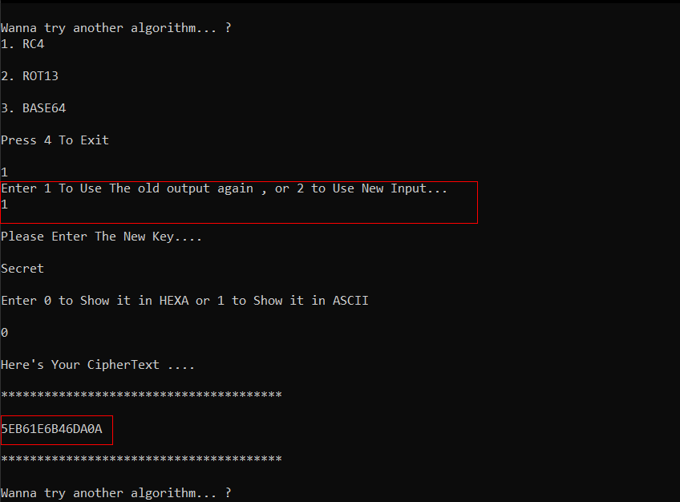

# Crypto-asm

## Project description
Implementation of Some **encryption/Encoding** routines: 
1. ROT13
2. RC4
3. Base64

### Features
The User can:
1. Choose from one of these Routines. 
2. Use Multi stage Encryption By redirecting the output of one stage to the next stage.

### Usage 
- Main menu


- RO13 choice


Cyberchef output


- Redirection the output to Next stage



- Cyberchef Output


<hr>

### Brief Description

1. ROT13
is a simple letter substitution cipher that replaces a letter with the 13th letter after it in the alphabet 
Because there are 26 letters (2×13) in the basic Latin alphabet, ROT13 is its own inverse; that is, to undo ROT13, the same algorithm is applied, so the same action can be used for encoding and decoding.


> C code
```C
char text[256] = {'D','o','L','a','X','.','E'};
void ROT13(char *text){
	int i,n;
	// char ch;
	int len = strlen(text); /*strlen should be implemented too!*/
	for(i=0;i<len;i++){
		n = text[i];
		if (n>=65 && n<=90){
			/*Dealing with Upper case*/
			if(n>=65 && n <= 77){
				/*if the char is between A (65) and M (77) simply add 13, 
				it still didn't exceeded 90 (Z)*/
			n = n+13;
			text[i] = (char)n; 
		}
		else{
			/* chars from N to Z deals with wrapping */
			n = n-13;
			text[i] = (char)n;
			}
		}
		else if (n >= 97 && n <=122){
			/*lower case chars*/
			if (n >=97 && n <= 109){
				/*same as in upper case*/
				n=n+13;
				text[i] = (char)n;
			}
			else{
				n=n-13;
				text[i] = (char)n;
			}
		}
	}
}
```

2. RC4 


RC4, is a stream cipher created in 1987. A stream cipher is a type of cipher that operates on data a byte at a time to encrypt that data. RC4 is one of the most commonly used stream ciphers, having been used in Secure Socket Layer (SSL)/ Transport Layer Security (TLS) protocols. 
RC4 generates a pseudorandom stream of bits (a keystream). As with any stream cipher, these can be used for encryption by combining it with the plaintext using bit-wise exclusive-or; decryption is performed the same way (since exclusive-or is a symmetric operation). (This is similar to the Vernam cipher except that generated pseudorandom bits, rather than a prepared stream, are used.) To generate the keystream, the cipher makes use of a secret internal state which consists of two parts:
1. A permutation of all 256 possible bytes (denoted "S" below).
2. Two 8-bit index-pointers (denoted "i" and "j").


> The key-scheduling algorithm (KSA)
```
for i from 0 to 255
    S[i] := i
endfor
j := 0
for i from 0 to 255
    j := (j + S[i] + key[i mod keylength]) mod 256
    swap values of S[i] and S[j]
endfor
```
> The pseudo-random generation algorithm (PRGA)
```
i := 0
j := 0
while GeneratingOutput:
    i := (i + 1) mod 256
    j := (j + S[i]) mod 256
    swap values of S[i] and S[j]
    K := S[(S[i] + S[j]) mod 256]
    output K
endwhile
```

3. Base64
Base64 is a group of binary-to-text encoding schemes that represent binary data (more specifically, a sequence of 8-bit bytes) in sequences of 24 bits that can be represented by four 6-bit Base64 digits 
Each Base64 digit can take on 64 different values, encoding 6 bits of data. Which characters are chosen to represent the 64 values varies between implementations. The general strategy is to choose 64 characters that are common to most encodings and that are also printable. This combination leaves the data unlikely to be modified in transit through information systems, such as email, that were traditionally not 8-bit clean. For example, MIME's Base64 implementation uses A–Z, a–z, and 0–9 for the first 62 values 


<hr>

## Team Members

1. [Ibrahim Yasser](https://github.com/ibrahemyasser)
2. [Ahmed Sayed](https://github.com/ahmed1958)
3. [Ahmed Mohammed Awwad](https://github.com/Ahmed-Awwad99)
4. [Ahmed Mohammed Ali](https://github.com/ahmedmalii)
5. [Mohamed Adel](https://github.com/d01a)

